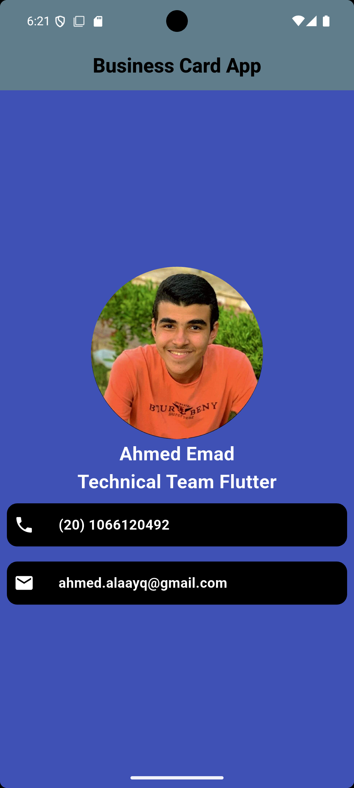

# Business Card App

## 🌟 Overview
The **Business Card App** is a sleek and modern Flutter application that lets you showcase your professional identity with style. Whether you're networking or sharing your contact details, this app makes it effortless and impressive. Perfect for Flutter enthusiasts and professionals who want a stunning virtual business card.

## ✨ Features
- 📸 **Profile Image:** Personalize with your photo.
- 🏷️ **Name & Designation:** Highlight your role and identity.
- 📞 **Clickable Phone Number:** Call with a single tap.
- 📧 **Interactive Email Address:** Send emails instantly.

## 📱 Screenshot


## 🚀 Get Started
1. **Clone the Repo:**
   ```
   git clone <repository_url>
   ```
2. **Open the Project:** Use your favorite IDE (VS Code, Android Studio, etc.).
3. **Run the App:**
   ```
   flutter run
   ```

## 💻 Requirements
- Flutter SDK installed.
- Compatible IDE (e.g., Android Studio, VS Code).
- A device or emulator to test the app.

## 🔥 Why Choose This App?
- Easy to customize.
- Clean and attractive design.
- Great way to learn Flutter while building something practical.

---

### 💡 Created by Ahmed Emad
**Technical Flutter**  
**GDG On Campus Benha 24.25**

**⚡ Showcase your identity with the Business Card App!**

---
